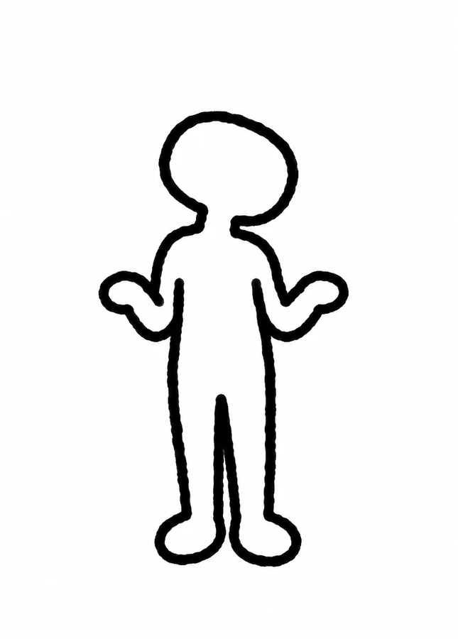
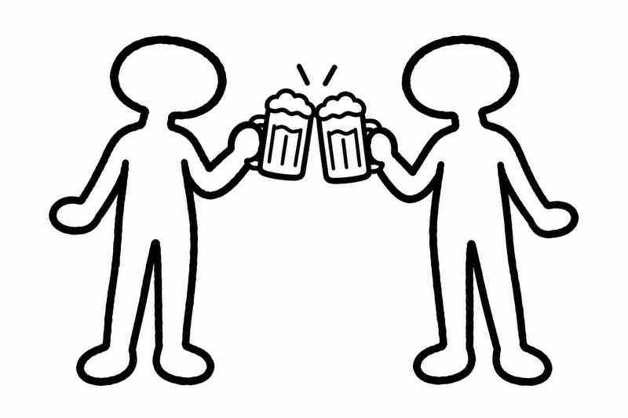

# WS共通コンセプトキャラクター

2026-09-12採用。今回の「デザインの言語化」ワークショップ資料全体で、今後キャラクターを使用する際の共通要件とする。初回の反映箇所は12ページ。全ページへの一律配置は行わない。

## 採用ビジュアル

この画像を形状・線・体型の基準とする。新しいポーズを制作する場合も、同じキャラクターとして認識できることを優先する。

## デザイン要件

- 人間を抽象化した、輪郭線だけのキャラクター。
- モノトーン。黒〜チャコールの太い線、白または透過の内部・背景。色付きの服や肌色は使わない。
- 線は少し揺らぎのある手描き調。過度なざらつきや細かな装飾は加えない。
- 顔は大福のようにやや横に広い、柔らかな丸。目・鼻・口・眉などの顔のパーツを描かない。
- 髪、服、アクセサリーを描かない。
- 胴体はすっきりとした人型。極端に太い胴・大きな腹・過大な頭にしない。採用画像の頭身と体の幅を維持する。
- 手は指を描き分けない、丸いミトン状。足も丸く単純化する。
- 感情は首の傾き、姿勢、腕や手の動きで伝える。12ページでは首をかしげて両手を広げ、戸惑いを表す。

## 資料内での使い方

- 受講者の疑問や戸惑い、考える間を代弁する補助的な存在として使う。
- 主役は講義内容と見出し。文字に重ねず、余白に配置する。
- 既存資料の太い輪郭とシンプルな図形に合わせる。キャラクター自体に資料のアクセントカラーを追加しない。
- 表情違いは顔の追加ではなくポーズで作る。アニメ調の人物、動物、吹き出し型マスコットへ変更しない。
- 縦横比を保って縮小する。白背景の採用画像は明るいスライド上で乗算表示し、背景との境界を目立たせない。

## 素材と更新

- 採用素材: `public/comic-listener.webp`
- スライド埋め込み: `app/comic-listener.ts`（同じ素材のデータURI）
- 現在の使用箇所: 12ページ、`comic-aside`。
- 形状・体型・線・色を変更する場合は、新しい素案を確認してから採用素材と本要件を更新する。
- 提示された参考イラストは方向性の参考。採用素材は新規生成した図案であり、参考画像そのものや透かし・ロゴは素材として使用しない。

## 追加ポーズ：乾杯（15ページ）

二人がジョッキを合わせるポーズ。ジョッキ・液体・泡もモノトーンの線画とし、顔のパーツは追加しない。対話のメッセージを補助する用途。素材は `public/character-cheers.webp`、埋め込みは `app/character-cheers.ts`。
