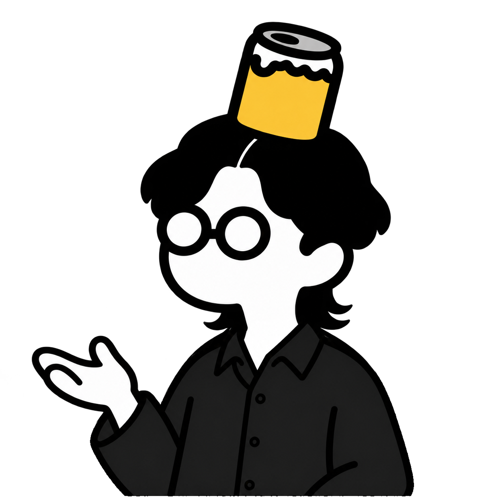

# WSコンセプトキャラクター

2026-09-13採用。「デザインの言語化ワークショップ」のコンセプトキャラクターとして、この画像を基準にします。

## 採用ビジュアル

- 素材：`public/concept-character.png`
- 形式：PNG（RGBA、背景透過）
- サイズ：1254 × 1254 px
- 採用版：黒い襟付きシャツで、片手を開いて説明するポーズ

## デザインの基準

- 太く丸みのある黒い輪郭線と、シンプルな面で構成する。
- 髪型は黒髪のセンターパート。襟足は長めに伸ばす。
- 額から上に伸びる白い線で、髪の分け目を表現する。
- 太い黒縁の丸メガネ。顔・手・レンズは白を維持する。
- 頭上に黄色い缶を載せる。缶の底と頭の境目は黒くつなぎ、白い隙間を入れない。
- 服は無地の黒い襟付きシャツ。襟と前立て、ボタンをシンプルに表現する。
- 追加ポーズでも、髪型・顔・メガネ・缶・服・線の太さを基準画像に合わせる。
- 服の参考画像から参照したのはシャツのデザインのみ。参考画像の顔・肌色・髪・アクセサリーは取り入れない。

## 素材の使い方

- 縦横比を保って配置し、見出しや本文の読みやすさを優先する。
- 背景透過のPNGを通常表示で使う。顔・手・レンズなどの白い部分は透過させない。
- 格子模様は画像の一部として加えない。
- 編集や追加ポーズの制作では、この採用PNGをキャラクターの参照元にする。

## 以前の線画素材

以前の線画キャラクターの仕様は [旧キャラクターの仕様](concept-character-legacy.md) に保存しています。既存の線画素材とスライド内の配置は、そのまま保持しています。
